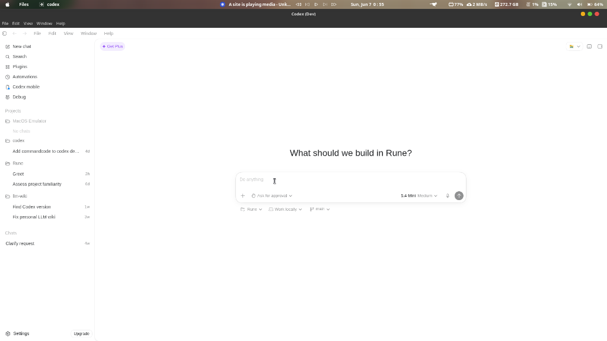
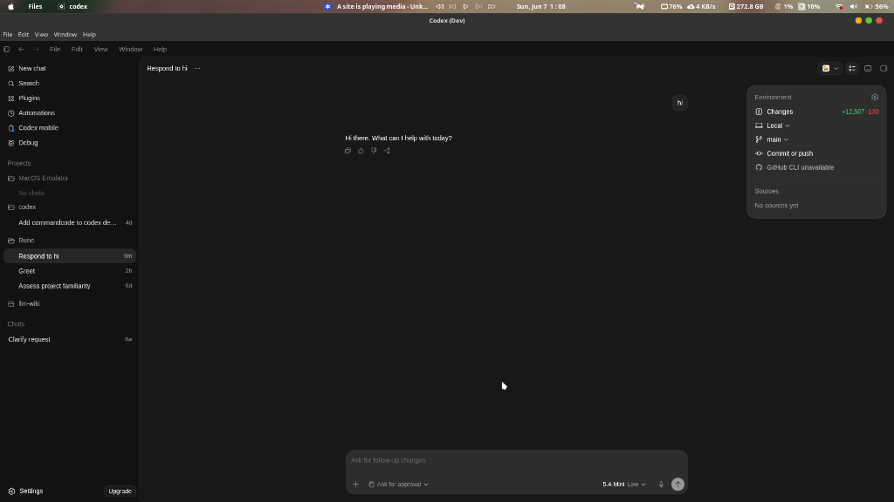

# MacRun

**MacRun** is a governed macOS application compatibility and runtime substitution platform for Linux.

> [!WARNING]
> **Developer / Architecture Preview Release**
> This repository represents an early architecture preview and developer prototype. It is NOT a production-ready system, nor is it a universal tool to "run any macOS app." It is published to showcase the systems architecture, runtime substitution governance, and compatibility engineering discipline.

---

## The Core Concept: Governed Compatibility

Rather than trying to build a monolithic macOS emulator or fully reimplementing the massive SwiftUI/AppKit/Metal rendering stacks, **MacRun** implements a hybrid compatibility model. It classifies applications into execution tiers and selects the lowest-complexity viable runtime strategy:

1. **Tier 0: Runtime Substitution** (Electron/Tauri/Wails) — Runs the app's HTML/JS/CSS assets against a native Linux runtime shell (Chromium/WebKitGTK) coupled with a governance-controlled API normalization and shim layer.
2. **Tier 1: CLI Compatibility** (Darling Substrate) — Executes CLI and POSIX-compliant macOS binaries using translation/compatibility layers.
3. **Tier 2: Lightweight Cocoa** (AppKit/Cairo/Wayland) — Executes simple native AppKit applications using flattened CoreAnimation and basic rendering proxies.
4. **Tier 3-4: Translation & Virtualization** (ARM64/QEMU & VM-Assisted Streaming) — Designed for heavy, deeply integrated macOS-native applications via high-performance window streaming, bridge daemons, and hotkey/clipboard synchronization.

---

## Current Status

- **Tier 0 (Electron Substitution)**: **Functional**. Successfully validates real, production-grade applications on Linux.
  - **Obsidian**: Launches, renders, and is fully usable.
  - **Claude Desktop**: Launches, renders, handles IPC/runtime initialization, and is fully functional.
- **Darling Integration (Tier 1-2)**: Infrastructure phase (adapters and substrate boundaries established).
- **ARM64 Translation (Tier 3)**: Planned / Exploratory.
- **VM-Assisted Execution (Tier 4B)**: Planned / Exploratory.

---

## Validation Proofs

We have proven the hybrid runtime substitution architecture using production-grade applications containing native module dependencies, multi-process IPC startup, and platform-specific rendering behaviors:

* **Obsidian**: Runs fully self-contained using runtime normalizations.
* **Claude Desktop**: Resolves Electron version-specific API drift using our governed normalization registry.
* **Codex Desktop**: Executes dynamically under negotiated Electron `v42.3.3` with solid background styling and full UI hydration, integrating its local Rust backend CLI and native SQLite state databases on Linux.

### Codex Desktop on Linux (Light Mode & Dark Mode)
| Light Mode | Dark Mode |
|---|---|
|  |  |

For a detailed step-by-step walkthrough on preparing, compiling dependencies, and launching Codex, see the **[Codex Desktop Launch Guide](docs/guides/codex/README.md)**.

---

## Non-Goals

To maintain project scope and integrity, the following are explicitly **out of scope**:
- **Not a macOS Desktop Clone**: We do not recreate Finder, Dock, or the macOS desktop environment.
- **Not a Wine Replacement**: We do not target general-purpose Windows or macOS game translation.
- **Not a Security Sandbox**: This platform does not provide containment guarantees beyond native process boundaries.
- **Not Universal Compatibility**: We do not promise SwiftUI, Metal, or AppKit parity.
- **Not Production-Ready**: Underactive components are under active design and stubbed.

---

## Quick Start: Running Applications

To build the platform, deploy the integration shims, and execute macOS app bundles natively on Linux:

### 1. Build and Install Shims
Compile the orchestrator CLI and install the javascript compatibility layers:
```bash
# Compile the orchestrator
cmake --build build

# Install integration shims to cached runtime path (~/.cache/macrun/shims)
./runtime/shims/install.sh
```

### 2. Prepare & Launch macOS Apps

To run a macOS application natively on Linux under `macRun`, follow this step-by-step workflow:

#### Step A: Extract the App Bundle
If you have a macOS disk image (`.dmg`), extract the `.app` bundle using `7z`:
```bash
7z x /path/to/Application.dmg -o/tmp/extracted-app/
```

#### Step B: Classify the Application
Run capability detection on the extracted `.app` bundle to verify the execution tier classification and compatibility plan:
```bash
./build/tooling/macrun-cli/macrun-cli --plan-only "/tmp/extracted-app/Application.app"
```

#### Step C: Resolve Native Modules & Helpers
* **Darwin-Native Node Modules (`.node`)**: macOS Electron apps often compile binary bindings for macOS. Run with the bypass variable `MACRUN_ALLOW_DARWIN_NATIVE=1` to allow execution with dynamic runtime Proxy stubbing. For modules essential to local state storage (e.g. `@vscode/sqlite3` in Cursor or `better-sqlite3` in Codex), compile the native module on Linux targeting Electron `28.3.3` (using `@electron/rebuild`) and substitute it inside the app's `node_modules`.
* **Helper CLI Binaries**: If the application spawns a bundled macOS command-line executable (e.g. Codex's stdio app-server helper), you must locate or compile a Linux-native ELF version of that binary and set the application-specific path environment variable (e.g. `CODEX_CLI_PATH`).

#### Step D: Launch the Application
Run the launcher tool pointing to the extracted `.app` path with the required environment configurations:

* **Obsidian**:
  ```bash
  MACRUN_ALLOW_DARWIN_NATIVE=1 \
  NODE_PATH=~/.local/npm-global/lib/node_modules \
  ./build/tooling/macrun-cli/macrun-cli --launch "/tmp/obsidian-run/Obsidian.app"
  ```

* **Claude Desktop**:
  ```bash
  MACRUN_ALLOW_DARWIN_NATIVE=1 \
  NODE_PATH=~/.local/npm-global/lib/node_modules \
  MACRUN_DIAG_RENDERER=1 MACRUN_DIAG_MAIN=1 \
  ./build/tooling/macrun-cli/macrun-cli --launch --diagnostics "/tmp/claude-run/Claude/Claude.app"
  ```

* **Cursor**:
  ```bash
  MACRUN_ALLOW_DARWIN_NATIVE=1 \
  NODE_PATH=~/.local/npm-global/lib/node_modules \
  MACRUN_DIAG_RENDERER=1 MACRUN_DIAG_MAIN=1 \
  ./build/tooling/macrun-cli/macrun-cli --launch --diagnostics "/tmp/cursor-run/Cursor.app"
  ```

* **Codex**:
  Refer to the comprehensive step-by-step **[Codex Desktop Launch Guide](docs/guides/codex/README.md)** for instructions on building the native SQLite module, mapping the Rust backend CLI, and launching:
  ```bash
  CODEX_CLI_PATH="/path/to/linux-native/codex" \
  MACRUN_ALLOW_DARWIN_NATIVE=1 \
  ./build/tooling/macrun-cli/macrun-cli --launch "/tmp/codex-run/Codex Installer/Codex.app"
  ```


---

## Architecture & Documentation

To explore the systems engineering details, governance rules, and implementation models, please refer to the public documentation index:

* **[Public Documentation Index](docs/public/README.md)**
* **[Architecture Overview](docs/public/ARCHITECTURE.md)**: Details runtime tiers, adapter boundaries, and execution substrates.
* **[Governance & Degradation](docs/public/GOVERNANCE.md)**: Governs API normalizations, shim execution, and graceful degradation classifications.
* **[Limitations & Tiers](docs/public/LIMITATIONS.md)**: Honest appraisal of supported tiers, compatibility policies, and non-goals.
* **[Detailed Project Overview](docs/public/project_overview.md)**: Our internal development objectives, core philosophy, and component boundaries.

---

## License

This project is licensed under the MIT License - see the [LICENSE](LICENSE) file for details.
