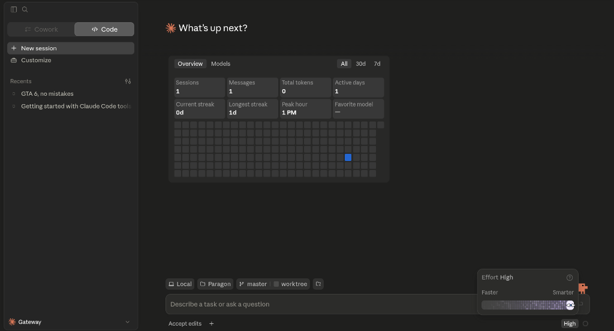

# Running Claude Desktop on Linux via macRun

This guide details the step-by-step process to execute **Claude Desktop** on Linux
using the **macRun** platform.

Claude Desktop is a **Class B: API Drift** application — it is self-contained (no
external backend processes) but is built against Electron APIs that drift from the
substituted Linux runtime. macRun resolves this through its API normalization registry
and prototype-level shim intercepts.

---

## Screenshot

Claude Desktop running on Linux via the macRun Electron 42 substrate:



---

## Step 1: Install Platform Prerequisites & Build macRun

Ensure your host environment has CMake, a C++20 compiler, and Node.js installed.

```bash
# 1. Compile the macRun orchestrator CLI
cmake -B build
cmake --build build

# 2. Deploy the core integration shims into the runtime cache (~/.cache/macrun/shims)
./runtime/shims/install.sh

# 3. Cache the Electron 42 substrate
./runtime/third_party/electron/acquire.sh --all
```

> [!NOTE]
> macRun dynamically inspects the Claude Desktop bundle and negotiates the closest
> available runtime version. Claude Desktop targets Electron 30+ APIs; the Electron 42
> substrate covers this range with normalization handling the API drift.

---

## Step 2: Obtain the Claude Desktop macOS App Bundle

Download the macOS installer from [claude.ai/download](https://claude.ai/download).
You will receive a `.dmg` file. Extract the `.app` bundle:

```bash
# Extract the bundle into a temporary workspace
mkdir -p /tmp/claude-run
7z x "/path/to/Claude.dmg" -o"/tmp/claude-run/"
```

This yields `/tmp/claude-run/Claude/Claude.app`.

---

## Step 3: Launch Claude Desktop

No native module compilation or backend substitution is required for Claude Desktop —
it is a Class B application and runs directly through the normalization layer.

```bash
MACRUN_ALLOW_DARWIN_NATIVE=1 \
NODE_PATH=~/.local/npm-global/lib/node_modules \
MACRUN_DIAG_RENDERER=1 MACRUN_DIAG_MAIN=1 \
./build/tooling/macrun-cli/macrun-cli --launch --diagnostics \
  "/tmp/claude-run/Claude/Claude.app"
```

### Environment Variables

| Variable | Purpose |
|----------|---------|
| `MACRUN_ALLOW_DARWIN_NATIVE=1` | Permits Darwin-compiled native modules to load with Proxy stubbing (safe for Class B) |
| `NODE_PATH=~/.local/npm-global/lib/node_modules` | Ensures the global Node module path is in scope for shim resolution |
| `MACRUN_DIAG_RENDERER=1` | Enables renderer process diagnostic output (useful on first launch) |
| `MACRUN_DIAG_MAIN=1` | Enables main process diagnostic output |
| `--diagnostics` | Activates the structured blank-window diagnostic pipeline |

> [!TIP]
> Once you confirm Claude Desktop launches correctly, you can drop the `MACRUN_DIAG_*`
> variables and `--diagnostics` flag from subsequent launches for cleaner output.

---

## Step 4: Sign In

On first launch, Claude Desktop will prompt for your Anthropic account credentials.
Sign in as normal. Credentials are stored in your system's `libsecret` keychain
(bridged from macOS Keychain) and will persist across relaunches.

---

## What the Platform Does Behind the Scenes

- **Bundle detection**: macrun-cli inspects `Claude.framework` to confirm this is an
  Electron application and determines the API version target.
- **ASAR extraction**: The `app.asar` archive is extracted; `boot-shim.js` is injected
  as a preload script before any application code runs.
- **API normalization**: The shim intercepts calls to `WebContentsView.setBackgroundColor`,
  `navigationHistory`, and other APIs that differ between macOS Electron builds and the
  Linux runtime substrate, patching them transparently via the normalization registry.
- **Path mapping**: macOS-style paths (`~/Library/Application Support/Claude`) are
  redirected to XDG-compliant Linux paths (`~/.config/Claude`).
- **Notifications and clipboard**: macOS notification and clipboard APIs are bridged to
  DBus/XDG equivalents.
- **Auto-updater**: Sparkle auto-update is disabled — updates are managed by re-running
  the extraction process with a new DMG.

---

## Known Limitations

| Limitation | Severity | Notes |
|-----------|----------|-------|
| Auto-updater disabled | Low | Download new DMG and re-extract to update |
| First-launch credential re-entry | Low | libsecret bridge; credentials persist after first sign-in |
| macOS-native file picker dialogs | Low | Falls back to standard Electron file picker |
