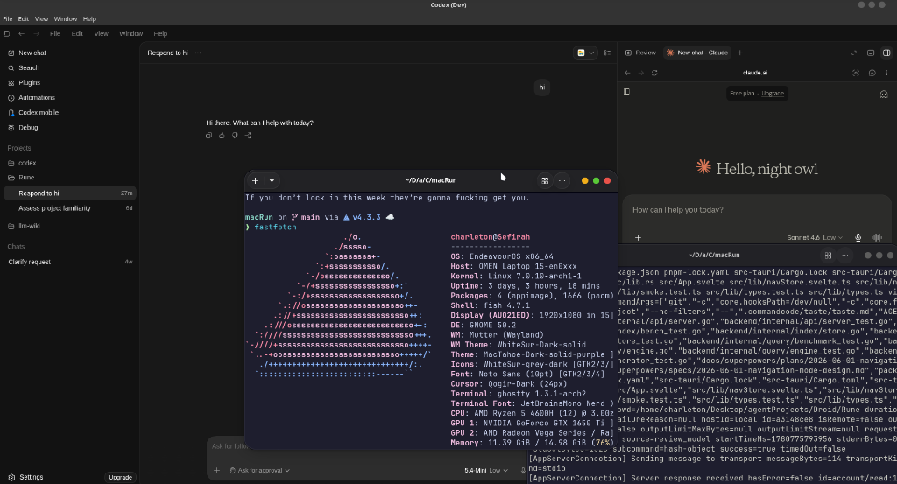

# Running Codex Desktop on Linux via macRun

This guide details the step-by-step process to execute the modern macOS **Codex Desktop** application natively on Linux using the **macRun** platform. 

Codex Desktop is a **Class D: Client-Server** application: it features an Electron front-end shell that communicates via a stdio-based Model Context Protocol (MCP) pipe with a bundled macOS command-line backend app-server (`codex`). It also relies on a local SQLite database module (`better-sqlite3`) to manage configuration, local projects, and user session states.

By following this guide, you will compile the required Linux-native SQLite module, rely on the automated path discovery and safety bypassing of macRun, and execute the app cleanly with correct window/theme layouts and zero-glitch solid backgrounds.

---

## Screenshot of Successful Execution

Here is Codex Desktop running on Ubuntu 24.04 via the macRun platform under our newly implemented C++ dynamic runtime shims:



---

## Step 1: Install Platform Prerequisites & Build macRun

Ensure your host environment has all standard build tools, Node.js, and compiler suites installed.

```bash
# 1. Compile the macRun orchestrator CLI
cmake -B build
cmake --build build

# 2. Deploy the core integration shims into the runtime cache (~/.cache/macrun/shims)
./runtime/shims/install.sh

# 3. Cache the negotiated Electron 28.3.3 substrate
./runtime/third_party/electron/acquire.sh 28.3.3
```

> [!NOTE]
> macRun dynamically inspects the Codex bundle framework metadata and negotiates the closest matching runtime version. It automatically resolves that Codex targets **Electron 28.3.3** using the `compat-db` Bundle ID metadata, automatically selecting the correct cached host substrate binary.

---

## Step 2: Extract the Codex macOS App Bundle

If you have downloaded the macOS installer (`.dmg`), extract the `.app` bundle using `7z`:

```bash
# Extract the bundle into a standard folder
7z x "/path/to/Codex.dmg" -o"/home/charleton/Downloads/TestApps/clean_slate/Codex/"
```
This will yield the folder `/home/charleton/Downloads/TestApps/clean_slate/Codex/Codex Installer/Codex.app`.

---

## Step 3: Resolve the Linux-Native CLI App-Server

### Rationale: Why is the CLI App-Server Required?
Codex is a Class D (Client-Server) application consisting of an Electron frontend and a background CLI app-server (`codex`) that communicates via a stdio MCP pipe. 
The bundled CLI binary in the macOS bundle (`Contents/Resources/app.asar.unpacked/bin/codex`) is a macOS-compiled Mach-O binary. If you attempt to execute it on Linux, it will fail with a `cannot execute binary file` error.

To solve this, a compatible Linux-native CLI replacement is run on the host. By installing the official npm package globally, the Linux-native `codex` executable is created in your local bin directory:

```bash
# Install the Codex NPM module globally
npm install -g @openai/codex
```

This installs the Linux-native CLI on your host. Normally, it is placed at:
`~/.local/bin/codex`

---

## Step 4: Automate Native Module Provisioning

Rather than manually downloading, patching, and copying native `.node` modules like `better-sqlite3`, you can leverage macRun's automated provisioning pipeline. 

Run the `provision` command pointing to the extracted bundle:

```bash
# Provision native modules automatically
./build/tooling/macrun-cli/macrun-cli provision --verbose "/home/charleton/Downloads/TestApps/clean_slate/Codex/Codex Installer/Codex.app"
```

### What Happens Behind the Scenes:
1. macRun scans the bundle's ASAR archives for native `.node` modules.
2. It detects that `better-sqlite3` and `node-pty` are required.
3. It checks its manifests for compatibility overrides, applies source patches for modern V8 sandbox compatibility, and compiles the modules from source inside a secure Bubblewrap sandbox.
4. The compiled Linux-native ELF `.node` binaries are stored in the local cache (`~/.cache/macrun/native/`) and staged automatically when launching.

---

## Step 5: Launch Codex Desktop

Execute the launch command without *any* manual environment overrides:

```bash
# Execute the launcher directly
./build/tooling/macrun-cli/macrun-cli --launch "/home/charleton/Downloads/TestApps/clean_slate/Codex/Codex Installer/Codex.app"
```

> [!TIP]
> * **Automatic CLI Discovery**: macRun automatically scans standard local directories (`~/.local/bin`, `~/bin`, etc.) and system `PATH` directories to find the native `codex` CLI binary and injects the `CODEX_CLI_PATH` environment variable automatically.
> * **Automatic Safety Bypass**: The launcher detects macOS-only native modules and automatically removes them from staging directories. This bypasses safety checks without requiring manual flags (such as `MACRUN_ALLOW_DARWIN_NATIVE=1`).
> * **Substrate Override**: The target Electron version `28.3.3` is loaded from `compat-db` reports and resolved automatically.
> * **Background Styling**: The shims automatically intercept calls to `BrowserWindow` and vibrancy modules to render solid backgrounds matching your host's dark/light color scheme.
