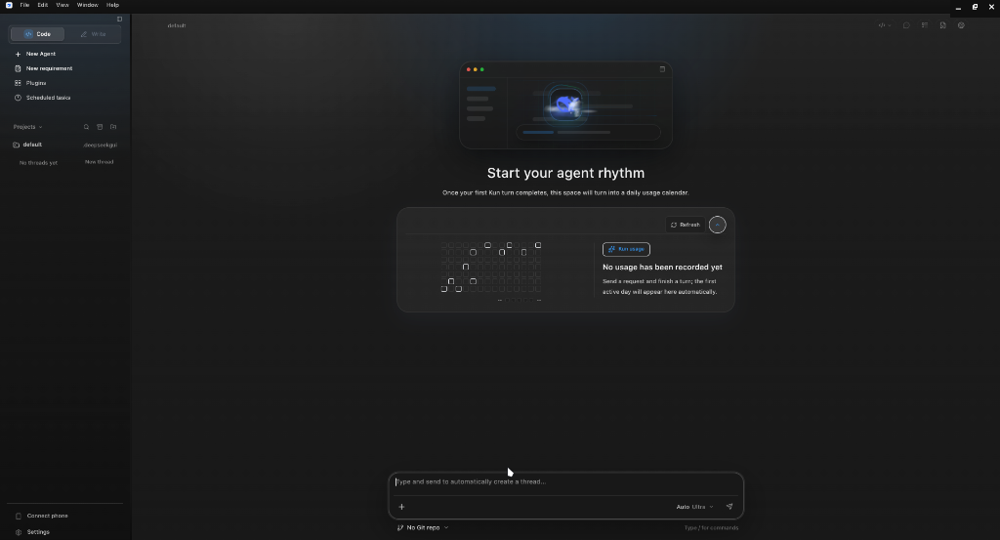

# Running DeepSeek GUI on Linux via macRun

This guide details the step-by-step process to execute the macOS **DeepSeek GUI** application natively on Linux using the **macRun** platform.

DeepSeek GUI is classified as a **Class C: IDE-Class Electron Platform** application. It relies on a local Node.js HTTP/SSE agent backend (`kun`) and a compiled C++ SQLite database wrapper (`better-sqlite3`) for managing project configurations, threads, and local agent memory.

By following this guide, you will substitute the native SQLite binary and execute the application with correct theme layouts and runtime options.

---

## Screenshot of Successful Execution

Here is DeepSeek GUI running natively on Linux via the macRun platform under our dynamic runtime shims:



---

## Step 1: Extract the DeepSeek macOS App Bundle

If you have downloaded the macOS installer (`.dmg`), extract the `.app` bundle using `7z`:

```bash
# Extract the bundle into a temporary workspace
7z x "/path/to/DeepSeek-GUI-0.2.5-mac-x64.dmg" -o"scratch/deepseek-extract"
```

This yields the extracted folder `scratch/deepseek-extract/DeepSeek GUI 0.2.5/DeepSeek GUI.app`.

---

## Step 2: Substitute the Linux-Native SQLite Module

Because DeepSeek GUI uses `better-sqlite3` for local storage, the macOS `.node` compiled binary in the app bundle will crash on Linux due to ABI and platform mismatches.

We must replace it with a Linux-native copy compiled for the same Electron ABI version. If you have already compiled `better-sqlite3` for Codex (targeting Electron 42.3.3), you can reuse that binary directly:

```bash
# Copy the pre-compiled Linux-native better_sqlite3.node to overwrite the macOS binary
cp /tmp/macrun_build_bettersqlite3/node_modules/better-sqlite3/build/Release/better_sqlite3.node \
  "scratch/deepseek-extract/DeepSeek GUI 0.2.5/DeepSeek GUI.app/Contents/Resources/app.asar.unpacked/node_modules/better-sqlite3/build/Release/better_sqlite3.node"
```

---

## Step 3: Launch DeepSeek GUI

Execute the `macrun-cli` binary pointing to the extracted `.app` package. We specify:
* `MACRUN_ELECTRON_VERSION=42.3.3` to force our modern Electron 42 substrate.
* `MACRUN_ALLOW_DARWIN_NATIVE=1` to authorize the substitution runtime execution.

```bash
MACRUN_ELECTRON_VERSION=42.3.3 \
MACRUN_ALLOW_DARWIN_NATIVE=1 \
MACRUN_DIAG_RENDERER=1 MACRUN_DIAG_MAIN=1 \
./build/tooling/macrun-cli/macrun-cli --launch "scratch/deepseek-extract/DeepSeek GUI 0.2.5/DeepSeek GUI.app"
```

---

## Under the Hood: Compatibility Engineering Details

During the test run, macRun resolved several platform-compatibility hurdles:

1. **Framework Version Override**: The framework detection pipeline parsed a secondary framework (e.g. `Squirrel.framework`) and falsely auto-detected Electron version `3.1.0`. By manually setting `MACRUN_ELECTRON_VERSION=42.3.3`, we bypass this override and boot under our vetted, modern Electron 42 runtime.
2. **Missing Unpacked Files Mitigation**: The DeepSeek GUI package contains a packaging discrepancy: its `app.asar` header references testing devDependencies (like `vitest` and `why-is-node-running`) that are not actually bundled in the production release's `app.asar.unpacked` folder. 
   To prevent `@electron/asar` from throwing `ENOENT` crashes during extraction, macRun intercepts file system actions in `asar-extract.js`. It catches missing files on `.unpacked` paths and dynamically returns mock empty buffers, allowing the extraction to complete successfully.
3. **API & Theme Normalizations**: Once launched, the C++ orchestrator injects `boot-shim.js` to strip out macOS-specific window vibrancy/transparency options and substitute solid backgrounds mapping to the host's dark/light color scheme, resulting in clean GUI rendering.
